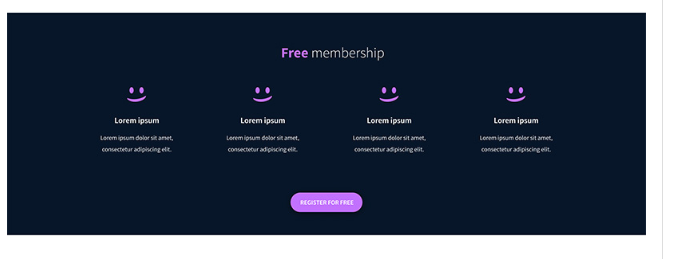

# alx_html_css

For this project we are required to build a smile school website. The section introduces what the school is about as per below.

The second section includes testimonilas from one of the students.

The third section as per below shows the different kind of tutorials that are offered.

Last section entails membership.

And finally FAQs.

The footer should look as per below.

